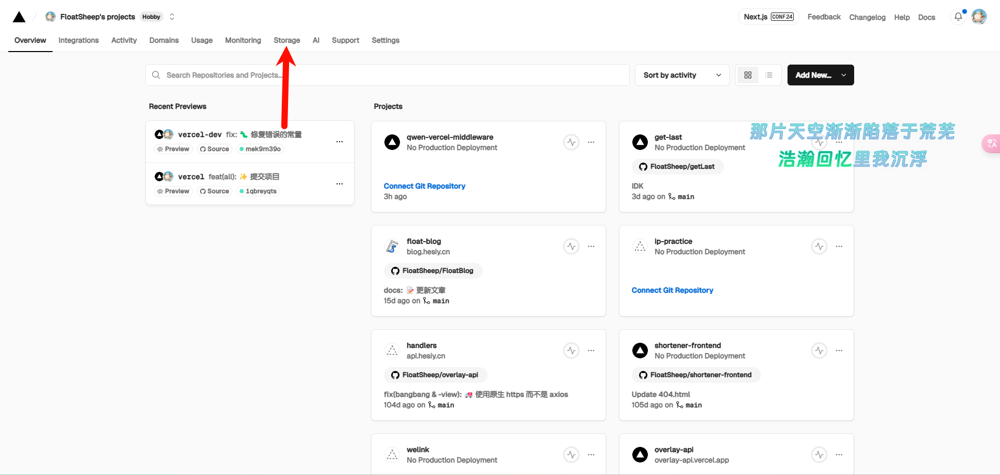
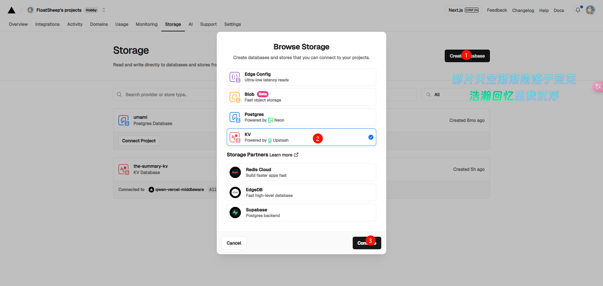
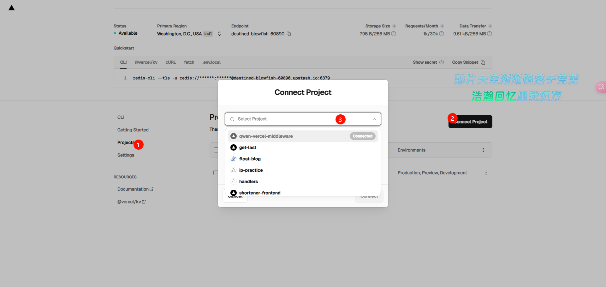
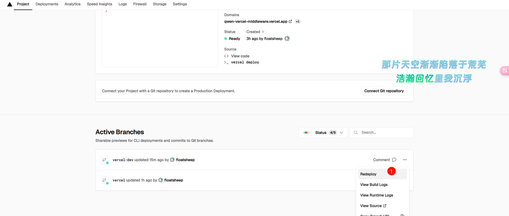

# Qwen-Vercel-Middleware

这是 main 分支的中间件，具有缓存、加快响应速度（由 Vercel 路由到 Cloudflare Worker 而不是访客路由）的功能

缺点：

- Cloudflare Worker 将等待 AI 完成后才进行输出，因此无法实现流式输出（需要前端进行实现）

## 快速开始

在 main 分支的基础上，将 Cloudflare Worker 代码修改为 [worker.js][1] 中的代码，然后点击下方的 Deploy 按钮，快速部署本项目

`SUMMARY_API` 为 Cloudflare Worker 绑定的域名

`PROXY_ENABLE` 请填写 false，**勿动**

如果有需要，可以修改项目 [api/summary.ts][3] 中的 headerConfig 来限制子域

接着添加 KV 储存，如图，进入 Storage 选项卡

如图，新建 KV Store

名称随意，接着连接到项目

进入 KV 配置界面，如下图操作

在下拉菜单中找到你刚部署的项目，连接即可

然后重新部署以生效 KV Store

进入项目的主页，往下滑动，选择最新的部署，点击最右边的三点，选择 Redeploy

然后绑定一个域名即可使用！

## 前端使用

[client][2] 文件夹中是简易的前端实现，包括脚本与样式，可以参考

简易实现附带了 FakeGPT 的鼠标光标特效

API 接口文档请查看 [APIFox][4]

[1]: </worker/worker.js>

[2]: </client>

[3]: </api/summary.ts>

[4]: <https://apifox.com/apidoc/shared-20d0a640-a6d3-40b2-87ba-fddfa1c10cc9>
